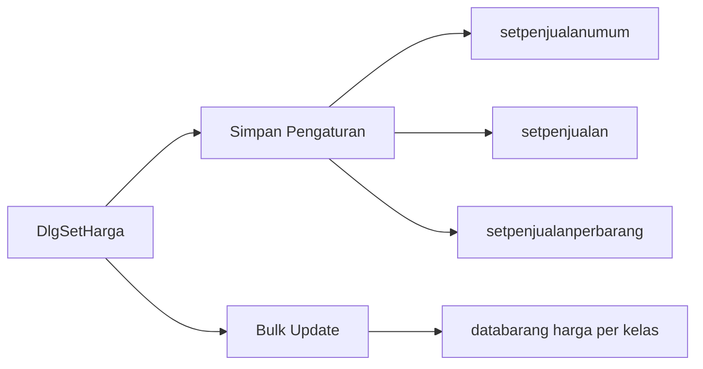
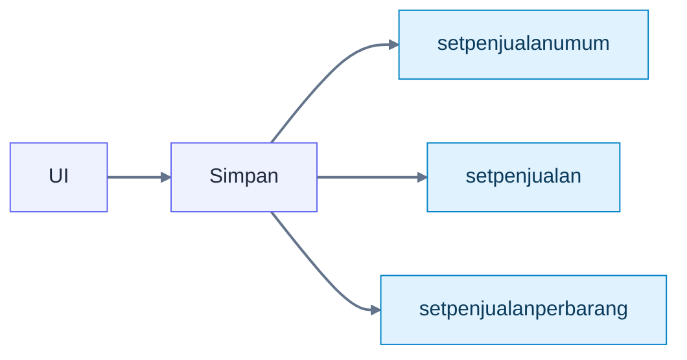
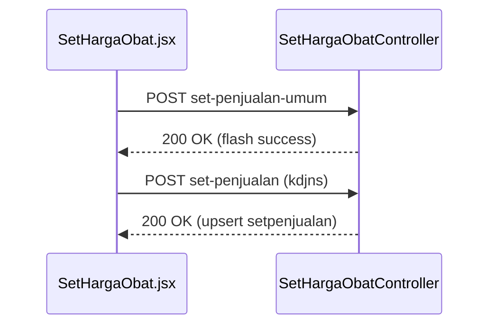
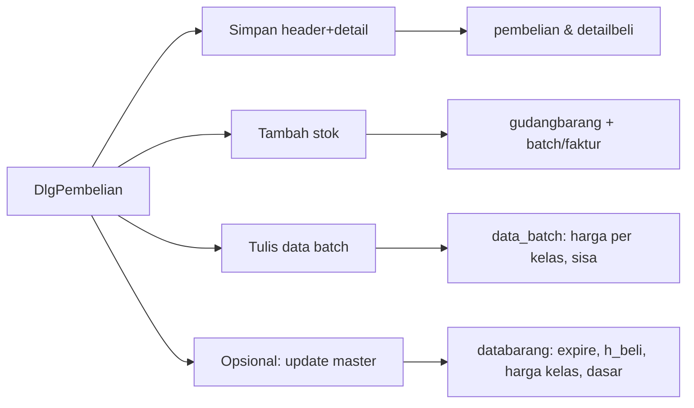

# Cara Membuat Dokumentasi User

Panduan singkat menyusun halaman dokumentasi pengguna agar otomatis muncul di menu Dokumentasi dan mempermudah pengembangan lanjutan.

## Lokasi & Penamaan
- Simpan file di `docs/DokumentasiUser/`.
- Gunakan nama file deskriptif, misalnya: `MasterData.md`, `Cara_Membuat_Dokumentasi_user.md`, `Fitur_Pembayaran.md`.
- Nama file akan otomatis diubah menjadi judul menu: karakter `_` atau `-` diubah menjadi spasi, dan huruf besar/kecil dirapikan.
- Menu "Install Aplikasi" selalu ditempatkan paling atas (berdasarkan `InstallAplikasi.md`).

## Struktur Konten Minimal
- Judul utama: `# Nama Topik`
- Ringkasan singkat tujuan halaman
- Prasyarat (opsional)
- Langkah-langkah penggunaan/konfigurasi
- Troubleshooting (opsional)
- Tautan terkait (opsional)

Contoh kerangka:

```md
# Nama Topik

Ringkasan singkat tentang topik ini.

## Prasyarat
- Item 1
- Item 2

## Langkah-langkah
1) Langkah pertama
2) Langkah kedua

## Troubleshooting
- Masalah umum dan solusinya.

## Tautan
- [Dokumen Terkait](https://contoh.link)
```

## Gaya Penulisan
- Gunakan poin `-` untuk daftar, dan `1)`/`1.` untuk langkah berurutan.
- Tampilkan perintah/kode dengan blok tiga backticks:

```bash
php artisan optimize:clear
npm ci --include=dev
npm run build
```

- Sorot inline dengan backticks: `@vite`, `route('docs')`, `public/build`.

## Menyisipkan Gambar
- Simpan aset gambar di `public/img/` agar bisa diakses publik.
- Sisipkan dengan path absolut: ``.

## Cara Menampilkan di Aplikasi
- Buka halaman dokumentasi: `/docs` atau menu "DOC".
- Semua file `.md` di `docs/DokumentasiUser/` otomatis muncul di panel kiri.
- Klik nama menu untuk melihat ringkasan; tekan tombol "Tampilkan detail lengkap" bila ada.
- Bisa mem-fokuskan menu tertentu lewat URL parameter: `/docs/<nama menu>`, contoh: `/docs/install aplikasi`.

## Tips Penyusunan
- Fokus ke tindakan pengguna (apa yang harus dilakukan, urutan jelas).
- Hindari paragraf panjang; lebihkan daftar terstruktur.
- Tambahkan Troubleshooting bila ada kendala yang sering muncul.
- Jaga konsistensi istilah sesuai aplikasi (mis. "Rawat Jalan", "Laboratorium").

## Checklist Sebelum Publish
- [ ] Nama file deskriptif dan berada di `docs/DokumentasiUser/`
- [ ] Konten memiliki judul dan langkah-langkah jelas
- [ ] Link dan gambar berfungsi (`/img/...`)
- [ ] Aset dibangun (`npm run build`) di server production
- [ ] Cek halaman `/docs` untuk memastikan menu muncul

## Catatan Renderer Mermaid (Diagram)

- Penulisan blok: gunakan tiga backticks dengan info string `mermaid` dan isi diagram di dalamnya.



- Jenis diagram yang didukung:
  - `flowchart` (alur proses), `sequenceDiagram` (interaksi), `classDiagram` (struktur), `stateDiagram` (state machine), `erDiagram` (relasi entitas), `journey` (alur pengalaman), `pie`, `timeline`, `gantt` (jadwal).

- Praktik terbaik penulisan:
  - Gunakan ID node tanpa spasi, label ditempatkan dalam tanda kurung siku: `id[Label Tampilan]`.
  - Pecah diagram besar menjadi beberapa diagram kecil per subtopik; performa lebih baik dan mudah dibaca.
  - Manfaatkan `subgraph` untuk mengelompokkan bagian terkait.
  - Hindari HTML mentah di label; renderer memakai `securityLevel: "strict"` sehingga konten non-Mermaid diabaikan.

- Styling dasar:
  - Definisikan kelas dan terapkan ke node/edge.



- Sequence diagram (contoh):



- Troubleshooting umum:
  - Diagram tidak muncul: pastikan blok memakai info string `mermaid` (bukan `md`, `bash`, dll).
  - Render jadi teks: koneksi CDN Mermaid gagal atau sintaks salah; periksa konsol browser dan validasi sintaks.
  - Diagram besar lambat: pecah menjadi beberapa blok, kurangi jumlah edge/label panjang.
  - Tema/warna tidak berubah: pastikan `classDef` dan `linkStyle` ditulis sebelum pemakaian, tanpa trailing koma.

- Contoh alur inventori (siap guna):


