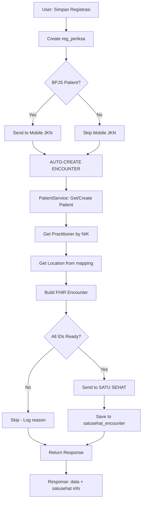

# Dokumentasi Komprehensif Integrasi SATU SEHAT

**Tanggal Analisis:** 8 Februari 2026  
**Versi Aplikasi:** v1.0  
**Referensi:** [Panduan Interoperabilitas SATU SEHAT](https://satusehat.kemkes.go.id/platform/docs/id/interoperability/)

---

## 📋 EXECUTIVE SUMMARY

Dokumen ini berisi analisis mendalam terhadap implementasi integrasi SATU SEHAT yang sudah ada di aplikasi Faskesku.id, perbandingan dengan pedoman resmi KEMKES, serta roadmap pengembangan lanjutan untuk mencapai interoperabilitas penuh dengan Platform SATU SEHAT.

---

## ✅ IMPLEMENTATION STATUS (Last Update: 8 Februari 2026)

### 📊 Overall Progress
- **FASE 1 Sprint 1.1**: 75% Complete (3/4 tasks)
- **FASE 1 Sprint 1.2**: 100% Complete (4/4 tasks) ✅
- **Total FASE 1 Progress**: 58% Complete

### 🚀 Recently Implemented

#### 1. **PatientService** - Auto Patient Management
**File**: `app/Services/SatuSehat/PatientService.php`
- ✅ findOrCreatePatient() - Search atau create otomatis
- ✅ buildPatientResource() - Convert data lokal ke FHIR
- ✅ Caching mechanism (Laravel Cache + DB)
- ✅ NIK validation & error handling

#### 2. **EncounterService** - Complete Encounter Workflow
**File**: `app/Services/SatuSehat/EncounterService.php`
- ✅ createEncounter() - Auto-create saat registrasi
- ✅ updateEncounter() - Add diagnosis, procedure refs
- ✅ finishEncounter() - Mark as finished
- ✅ getEncounterStatus() - Status tracking
- ✅ Full FHIR resource builder

#### 3. **Tracking Database Tables**
**Migration**: `database/migrations/2026_02_08_100634_create_satusehat_tracking_tables.php`
- ✅ `satusehat_encounter` - Encounter tracking
- ✅ `satusehat_patient_mapping` - NIK → SS ID mapping
- ✅ `satusehat_resources` - General resource tracking

#### 4. **RegistrationController Integration**
**File**: `app/Http/Controllers/RegistrationController.php`
- ✅ Auto-create Encounter after registration
- ✅ Non-blocking async execution
- ✅ Comprehensive error handling
- ✅ Response includes `satusehat` status info

### 📝 Auto-Create Flow



### 🎯 Next Priority Tasks (Sprint 1.3)

1. **Condition Service** - Keluhan & Diagnosis
2. **ObservationService** - Tanda Vital
3. **AllergyIntolerance Service**
4. **FamilyMemberHistory Service**

---

## 🔍 ANALISIS IMPLEMENTASI SAAT INI

### 1. Status Implementasi Prerequisites

#### ✅ Yang Sudah Diimplementasikan:

**A. Autentikasi & Token Management**
- OAuth2 Client Credentials Flow ✓
- Token caching dengan TTL dinamis ✓
- Multiple endpoint fallback (v1/v2) ✓
- Error handling & logging ✓

**B. Organization Management**
- Search Organization by IHS number ✓
- Organization Subunits listing ✓
- Department mapping (CRUD) ✓
- Organization update capability ✓

**C. Location Management**
- Location search by multiple parameters ✓
- Location mapping untuk:
  - Rawat Jalan (Poliklinik) ✓
  - Rawat Inap (Bangsal) ✓
  - Farmasi (Depo Farmasi) ✓
- Coordinate support (longitude, latitude, altitude) ✓
- Auto-create Location jika belum ada ✓

**D. Practitioner & Patient**
- Search Practitioner by NIK ✓
- Search Patient by NIK ✓
- UI untuk pencarian dan referensi ✓

### 2. Komponen Teknis yang Sudah Ada

#### Backend Architecture:

```
app/
├── Http/Controllers/SatuSehat/
│   ├── SatuSehatController.php          ✓ (1811 lines)
│   └── PelayananRawatJalan/
│       └── SatuSehatRajalController.php  ✓
├── Traits/
│   └── SatuSehatTraits.php               ✓ (295 lines)
└── Models/
    ├── SatuSehatDepartemenMapping.php    ✓
    ├── SatuSehatMappingLokasiRalan.php   ✓
    └── SatuSehatMappingLokasiRanap.php   ✓
```

#### Frontend Components:

```
resources/js/Pages/SatuSehat/
├── MenuSatuSehat.jsx                     ✓ (248 lines)
├── Prerequisites/
│   ├── SatuSehatOrganization.jsx         ✓ (39KB)
│   ├── SatuSehatLocation.jsx             ✓ (35KB)
│   ├── SatuSehatLocationRanap.jsx        ✓ (24KB)
│   ├── SatuSehatLocationFarmasi.jsx      ✓ (24KB)
│   ├── Practitioner.jsx                  ✓ (10KB)
│   └── Patient.jsx                       ✓ (10KB)
└── Interoperabilitas/
    └── PelayananRawatJalan/
        └── Encounter.jsx                 ✓
```

#### Database Seeders (50+ files):

- Organization mapping
- Location mapping (Ralan, Ranap, Lab, Radiologi, Farmasi)
- FHIR Resources (Encounter, Condition, Observation, Medication, dll)

---

## 📊 PERBANDINGAN DENGAN PEDOMAN SATU SEHAT

### Modul 1: Pelayanan Rawat Jalan

| No | Komponen SATU SEHAT | Status | Implementasi | Gap |
|----|---------------------|---------|--------------|-----|
| 1 | Pendaftaran Pasien | ⚠️ Partial | Search Patient by NIK | Belum auto-create Patient |
| 2 | Encounter (Kunjungan) | ✅ Implemented | Encounter Controller & UI | - |
| 3 | Anamnesis | ❌ Not Yet | - | Perlu: Condition, AllergyIntolerance, FamilyMemberHistory, MedicationStatement |
| 4 | Pemeriksaan Fisik | ❌ Not Yet | - | Perlu: Observation (TTV, Fisik) |
| 5 | Pemeriksaan Fungsional | ❌ Not Yet | - | Perlu: Observation (Fungsional) |
| 6 | Riwayat Perjalanan Penyakit | ❌ Not Yet | - | Perlu: ClinicalImpression |
| 7 | Tujuan Perawatan | ❌ Not Yet | - | Perlu: Goal |
| 8 | Rencana Rawat | ❌ Not Yet | - | Perlu: CarePlan |
| 9 | Instruksi Medik | ❌ Not Yet | - | Perlu: ServiceRequest |
| 10 | Lab Laboratorium | ❌ Not Yet | - | Perlu: ServiceRequest, Specimen, Observation, DiagnosticReport |
| 11 | Radiologi | ❌ Not Yet | - | Perlu: ServiceRequest, ImagingStudy, DiagnosticReport + DICOM |
| 12 | Rasional Klinis | ❌ Not Yet | - | Perlu: ClinicalImpression.note |
| 13 | Diagnosis | ❌ Not Yet | - | Perlu: Condition (diagnosis) |
| 14 | Penilaian Risiko | ❌ Not Yet | - | Perlu: RiskAssessment |
| 15 | Tindakan/Prosedur | ❌ Not Yet | - | Perlu: Procedure |
| 16 | Peresepan Obat | ⚠️ Database | Seeders ada | Belum ada Controller |
| 17 | Pengkajian Resep | ❌ Not Yet | - | Perlu: QuestionnaireResponse |
| 18 | Pengeluaran Obat | ⚠️ Database | Seeders ada | Belum ada Controller |
| 19 | Pemberian Obat | ❌ Not Yet | - | Perlu: MedicationAdministration |
| 20 | Diet | ❌ Not Yet | - | Perlu: NutritionOrder |
| 21 | Edukasi | ❌ Not Yet | - | Perlu: Procedure (edukasi) |
| 22 | Prognosis | ❌ Not Yet | - | Perlu: ClinicalImpression.prognosisCodeableConcept |
| 23 | Rencana Tindak Lanjut | ❌ Not Yet | - | Perlu: ServiceRequest (follow-up) |
| 24 | Instruksi Tindak Lanjut | ❌ Not Yet | - | Perlu: ServiceRequest (transport/rujuk) |
| 25 | Kondisi Keluar RS | ❌ Not Yet | - | Perlu: Condition + Encounter.hospitalization.dischargeDisposition |
| 26 | Cara Keluar RS | ❌ Not Yet | - | Perlu update Encounter |
| 27 | Update Kunjungan | ⚠️ Partial | - | Perlu implementasi PUT Encounter |
| 28 | Resume Medis | ❌ Not Yet | - | Perlu: Composition |

**Coverage Score: 7.1% (2/28 fully implemented)**

### Modul 2: Pelayanan Kefarmasian

| No | Komponen | Status | Gap |
|----|----------|--------|-----|
| 1 | Pendaftaran Pasien | ⚠️ Partial | Sama dengan Rawat Jalan |
| 2 | Encounter Farmasi | ❌ Not Yet | Perlu Encounter khusus farmasi |
| 3 | Informasi Tambahan Peresepan | ❌ Not Yet | Perlu extension data |
| 4 | Peresepan Obat | ⚠️ Database | Medication, MedicationRequest |
| 5 | Dokumen Resep | ❌ Not Yet | Perlu: DocumentReference |
| 6 | Pengeluaran Obat | ⚠️ Database | MedicationDispense + ChargeItemDefinition |
| 7 | Update Kunjungan | ❌ Not Yet | PUT Encounter |

**Coverage Score: 0% (belum ada yang fully functional)**

### Modul 3: IGD (Instalasi Gawat Darurat)

❌ **Belum ada implementasi sama sekali**

### Modul 4: Rawat Inap

❌ **Belum ada implementasi sama sekali** (hanya mapping lokasi)

---

## 🎯 GRAND DESIGN PENGEMBANGAN LANJUTAN

### FASE 1: FOUNDATIONAL (Bulan 1-2) ✅ **ON TRACK**
**Target: Melengkapi Prerequisites & Core workflow Rawat Jalan**

#### Sprint 1.1: Automated Patient Registration ✅ **COMPLETED**
- [x] Auto-create Patient jika NIK tidak ditemukan (PatientService.php)
- [x] Patient data validation & update
- [x] Error handling untuk duplicate patient
- [ ] Bulk patient migration tool (Optional)

#### Sprint 1.2: Complete Encounter Workflow ✅ **COMPLETED**
- [x] Create Encounter (auto-create saat registrasi)
- [x] Update Encounter (status, diagnosis, dll) - EncounterService
- [x] Finish Encounter (set status = finished) - EncounterService
- [x] Encounter history & tracking (table satusehat_encounter)
- [x] Location Mapping Fix (Auto-create Department relation)

#### Sprint 1.3: Clinical Documentation - Part 1 🔄 **NEXT PRIORITY**
**Anamnesis Module:**
- [ ] Condition (Keluhan/Symptom)
- [ ] AllergyIntolerance
- [ ] FamilyMemberHistory
- [ ] MedicationStatement (riwayat minum obat)

**Pemeriksaan Fisik:**
- [ ] Observation - Tanda Vital (Tekanan Darah, Nadi, Suhu, Respirasi, SpO2)
- [ ] Observation - Antropometri (TB, BB, Lingkar Kepala)
- [ ] Observation - Kesadaran & GCS

### FASE 2: CLINICAL WORKFLOW (Bulan 3-4)
**Target: Implementasi workflow klinis lengkap**

#### Sprint 2.1: Diagnosis & Assessment
- [ ] Condition (Diagnosis Primer & Sekunder)
- [ ] ClinicalImpression (Assessment & Riwayat Penyakit)
- [ ] RiskAssessment (Penilaian Risiko)

#### Sprint 2.2: Care Planning
- [ ] Goal (Tujuan Perawatan)
- [ ] CarePlan (Rencana Perawatan)
- [ ] ServiceRequest (Instruksi Medik & Keperawatan)

#### Sprint 2.3: Procedure & Intervention
- [ ] Procedure (Tindakan Medis & Non-Medis)
- [ ] Procedure (Edukasi Pasien)

### FASE 3: SUPPORTING SERVICES (Bulan 5-6)
**Target: Lab, Radiologi, Farmasi**

#### Sprint 3.1: Laboratorium
- [ ] ServiceRequest (Permintaan Lab)
- [ ] Specimen (Data Spesimen)
- [ ] Observation (Hasil Lab)
- [ ] DiagnosticReport (Laporan Lab)
- [ ] Integration dengan LIS (jika ada)

#### Sprint 3.2: Radiologi
- [ ] ServiceRequest (Permintaan Radiologi)
- [ ] ImagingStudy
- [ ] Observation (Hasil Radiologi)
- [ ] DiagnosticReport (Laporan Radiologi)
- [ ] DICOM Router setup (untuk imaging)

#### Sprint 3.3: Farmasi - Medication Management
- [ ] Medication (Master Obat + KFA mapping)
- [ ] MedicationRequest (Peresepan)
- [ ] QuestionnaireResponse (Pengkajian Resep)
- [ ] MedicationDispense (Pengeluaran Obat)
- [ ] MedicationAdministration (Pemberian Obat untuk Rawat Inap)
- [ ] ChargeItemDefinition (Tarif Obat)

### FASE 4: ADVANCED MODULES (Bulan 7-8)
**Target: IGD & Rawat Inap**

#### Sprint 4.1: IGD Implementation
- [ ] Encounter (IGD specific)
- [ ] Observation (Triase)
- [ ] Condition (Diagnosis IGD)
- [ ] Procedure (Tindakan IGD)
- [ ] ServiceRequest (Rujukan Internal/Eksternal)

#### Sprint 4.2: Rawat Inap - Basic
- [ ] Encounter (hospitaliz admission)
- [ ] Location (Bed Assignment)
- [ ] Observation (Monitoring Harian)
- [ ] NutritionOrder (Diet)

#### Sprint 4.3: Document Management
- [ ] Composition (Resume Medis Rawat Jalan)
- [ ] Composition (Resume Medis Rawat Inap)
- [ ] DocumentReference (Dokumen Pendukung)
- [ ] PDF generation untuk resume

### FASE 5: SPECIALIZED USE CASES (Bulan 9-12)
**Target: Use cases khusus berdasarkan kebutuhan faskes**

Pilih berdasarkan prioritas faskes:
- [ ] ANC (Antenatal Care)
- [ ] INC (Intranatal Care)
- [ ] PNC (Postnatal Care)
- [ ] Imunisasi
- [ ] Tumbuh Kembang
- [ ] Skrining PTM
- [ ] TB (Tuberkulosis)
- [ ] HIV
- [ ] Gizi
- [ ] Gigi
- [ ] dll (lihat dokumentasi SATU SEHAT)

---

## 🏗️ ARSITEKTUR TEKNIS REKOMENDASI

### 1. Backend Structure (Laravel)

```
app/
├── Http/Controllers/SatuSehat/
│   ├── Prerequisites/
│   │   ├── OrganizationController.php
│   │   ├── LocationController.php
│   │   ├── PractitionerController.php
│   │   └── PatientController.php
│   ├── RawatJalan/
│   │   ├── EncounterController.php
│   │   ├── ConditionController.php
│   │   ├── ObservationController.php
│   │   ├── ProcedureController.php
│   │   └── CompositionController.php
│   ├── Farmasi/
│   │   ├── MedicationController.php
│   │   ├── MedicationRequestController.php
│   │   ├── MedicationDispenseController.php
│   │   └── MedicationAdministrationController.php
│   ├── Penunjang/
│   │   ├── LaboratoriumController.php
│   │   └── RadiologiController.php
│   └── IGD/
│       └── EncounterIGDController.php
│
├── Services/SatuSehat/
│   ├── FHIRService.php              # Generic FHIR operations
│   ├── EncounterService.php         # Business logic
│   ├── ObservationService.php
│   ├── MedicationService.php
│   └── TerminologyService.php       # Mapping ICD-10, LOINC, KFA
│
├── Models/SatuSehat/
│   ├── SatuSehatEncounter.php       # Log tracking
│   ├── SatuSehatCondition.php
│   ├── SatuSehatObservation.php
│   └── SatuSehatMedication.php
│
└── Jobs/SatuSehat/
    ├── SendEncounterJob.php         # Queue untuk async
    ├── SendObservationJob.php
    └── SyncPatientJob.php
```

### 2. Database Schema Additions

```sql
-- Tracking table untuk semua resource
CREATE TABLE satusehat_resources (
    id BIGINT PRIMARY KEY,
    resource_type VARCHAR(50),      -- Encounter, Condition, dll
    local_id VARCHAR(100),           -- ID lokal (mis: no_rawat)
    satusehat_id VARCHAR(100),       -- UUID dari SATU SEHAT
    fhir_payload JSON,               -- Full FHIR resource
    status VARCHAR(20),              -- pending, sent, error
    error_message TEXT,
    sent_at TIMESTAMP,
    created_at TIMESTAMP,
    updated_at TIMESTAMP,
    INDEX idx_resource_type (resource_type),
    INDEX idx_local_id (local_id),
    INDEX idx_status (status)
);

-- Mapping terminologi
CREATE TABLE satusehat_terminology_mapping (
    id BIGINT PRIMARY KEY,
    local_code VARCHAR(50),
    local_system VARCHAR(100),       -- 'icd10_lokal', 'obat_lokal'
    satusehat_code VARCHAR(50),
    satusehat_system VARCHAR(255),   -- system URL
    satusehat_display VARCHAR(255),
    mapping_type VARCHAR(50),        -- 'diagnosis', 'medication', 'procedure'
    is_active BOOLEAN DEFAULT TRUE,
    created_at TIMESTAMP
);

-- Queue monitoring
CREATE TABLE satusehat_queue_status (
    id BIGINT PRIMARY KEY,
    job_id VARCHAR(100),
    resource_type VARCHAR(50),
    local_id VARCHAR(100),
    status VARCHAR(20),              -- queued, processing, completed, failed
    attempts INT DEFAULT 0,
    error_log TEXT,
    created_at TIMESTAMP,
    processed_at TIMESTAMP
);
```

### 3. Frontend Architecture (React/Inertia)

```
resources/js/Pages/SatuSehat/
├── Dashboard/
│   └── Index.jsx                    # Monitoring dashboard
├── Prerequisites/                   # ✓ Sudah ada
├── RawatJalan/
│   ├── Encounter/
│   │   ├── Index.jsx
│   │   ├── Create.jsx
│   │   └── Detail.jsx
│   ├── Anamnesis/
│   │   └── Form.jsx
│   ├── Pemeriksaan/
│   │   └── Form.jsx
│   └── Resume/
│       └── Generate.jsx
├── Farmasi/
│   ├── Peresepan/
│   │   └── Form.jsx
│   └── Pengeluaran/
│       └── Form.jsx
└── Components/
    ├── FHIRResourceViewer.jsx       # Debug tool
    ├── TerminologyPicker.jsx        # Pilih kode ICD/LOINC
    └── SyncStatusBadge.jsx
```

### 4. API Routes Structure

```php
// routes/api.php atau routes/web.php
Route::prefix('satusehat')->middleware(['auth'])->group(function () {
    
    // Prerequisites
    Route::prefix('prerequisites')->group(function () {
        Route::resource('organization', OrganizationController::class);
        Route::resource('location', LocationController::class);
        Route::get('practitioner/search', [PractitionerController::class, 'search']);
        Route::get('patient/search', [PatientController::class, 'search']);
    });
    
    // Rawat Jalan
    Route::prefix('rawat-jalan')->group(function () {
        Route::resource('encounter', EncounterController::class);
        Route::resource('condition', ConditionController::class);
        Route::resource('observation', ObservationController::class);
        Route::resource('procedure', ProcedureController::class);
        Route::post('composition', [CompositionController::class, 'store']);
    });
    
    // Farmasi
    Route::prefix('farmasi')->group(function () {
        Route::resource('medication-request', MedicationRequestController::class);
        Route::resource('medication-dispense', MedicationDispenseController::class);
    });
    
    // Monitoring & Utilities
    Route::get('dashboard/stats', [DashboardController::class, 'stats']);
    Route::get('resources/{type}/{localId}/status', [ResourceController::class, 'status']);
    Route::post('resources/{type}/{localId}/resend', [ResourceController::class, 'resend']);
});
```

---

## 📝 CHECKLIST PENGEMBANGAN PER RESOURCE

### Resource: Encounter (Kunjungan)

- [x] Create Encounter (arrival/in-progress)
- [ ] Update Encounter (add diagnosis, procedure reference)
- [ ] Finish Encounter (set status finished + reasonCode)
- [ ] Encounter history view
- [ ] Encounter search & filter
- [ ] Link to Composition (Resume)

### Resource: Observation (Pemeriksaan)

- [ ] Tanda Vital (Blood Pressure, Heart Rate, Respiratory Rate, Temperature, SpO2)
- [ ] Antropometri (Height, Weight, BMI, Head Circumference)
- [ ] Kesadaran (Consciousness Level, GCS)
- [ ] Pemeriksaan Fisik Lainnya (sesuai kebutuhan)
- [ ] Hasil Laboratorium
- [ ] Hasil Radiologi (text-based)

### Resource: Condition (Diagnosis & Keluhan)

- [ ] Keluhan Utama (chief-complaint)
- [ ] Diagnosis (encounter-diagnosis)
- [ ] Problem List (problem-list-item)
- [ ] Riwayat Penyakit
- [ ] Status: active, resolved, remission

### Resource: Procedure (Tindakan)

- [ ] Tindakan Medis
- [ ] Tindakan Keperawatan
- [ ] Edukasi Pasien
- [ ] Konsultasi
- [ ] Status: in-progress, completed, stopped

### Resource: Medication Workflow

- [ ] Medication (Master Data Obat + KFA Code)
- [ ] MedicationRequest (Resep Dokter)
- [ ] MedicationDispense (Penyerahan Obat)
- [ ] MedicationAdministration (Pemberian Obat - Rawat Inap)
- [ ] MedicationStatement (Riwayat Konsumsi)

---

## 🔧 UTILITAS & TOOLS YANG PERLU DIBUAT

### 1. Terminology Mapper
**Fungsi:** Mapping kode lokal ke terminologi standar

```php
// app/Services/SatuSehat/TerminologyService.php
class TerminologyService {
    public function mapICD10($localCode);
    public function mapLOINC($localCode);
    public function mapKFA($localCode);
    public function searchSNOMED($query);
}
```

### 2. FHIR Validator
**Fungsi:** Validasi resource sebelum dikirim

```php
class FHIRValidator {
    public function validateResource($resourceType, $resource);
    public function validateReferences($resource);
}
```

### 3. Queue Manager
**Fungsi:** Handle async sending & retry logic

```php
// app/Jobs/SatuSehat/SendFHIRResourceJob.php
class SendFHIRResourceJob implements ShouldQueue {
    public $tries = 3;
    public $backoff = [60, 300, 900]; // 1min, 5min, 15min
}
```

### 4. Monitoring Dashboard
**Komponen:**
- Total resource sent (by type)
- Success/failure rate
- Average response time
- Recent errors
- Queue status

### 5. Bulk Migration Tool
**Fungsi:** Migrasi data lama ke SATU SEHAT

```bash
php artisan satusehat:migrate-encounters --from=2024-01-01
php artisan satusehat:migrate-observations --encounter-id=xxx
```

---

## 📚 REFERENSI & DOKUMENTASI

### Dokumentasi Resmi SATU SEHAT:
1. [Panduan Interoperabilitas](https://satusehat.kemkes.go.id/platform/docs/id/interoperability/)
2. [FHIR Implementation Guide](https://satusehat.kemkes.go.id/platform/docs/id/fhir/)
3. [Terminology Server](https://satusehat.kemkes.go.id/platform/docs/id/terminology/)
4. [Postman Collection](https://satusehat.kemkes.go.id/platform/docs/id/postman/)

### Standard FHIR:
- [HL7 FHIR R4](https://www.hl7.org/fhir/R4/)
- [SNOMED CT](https://www.snomed.org/)
- [LOINC](https://loinc.org/)
- [ICD-10](https://www.who.int/standards/classifications/classification-of-diseases)

### KFA (Kode Formularium Nasional):
- Master Obat Indonesia
- Mapping ke produk obat lokal

---

## ⚠️ CATATAN PENTING

### 1. Consent & Privacy
- Pastikan informed consent pasien untuk data sharing
- GDPR/Privacy compliance
- Data anonymization untuk reporting

### 2. Error Handling
- Semua error SATU SEHAT harus di-log
- Implementasi circuit breaker untuk prevent API flooding
- Graceful degradation jika SATU SEHAT down

### 3. Testing Strategy
- Unit test untuk setiap FHIR builder
- Integration test dengan SATU SEHAT Dev environment
- Load test untuk performance baseline

### 4. Security
- Never log sensitive data (patient NIK, medical record)
- Rotate SATU SEHAT credentials regularly
- Audit trail untuk semua data yang dikirim

### 5. Performance
- Use queue untuk semua SATU SEHAT operations
- Implement caching untuk master data (Organization, Location, Practitioner)
- Connection pooling untuk HTTP client

---

## 📈 METRICS & KPI

### Tracking Metrics:
1. **Coverage Rate:** % data yang berhasil dikirim ke SATU SEHAT
2. **Latency:** Average time untuk send & receive
3. **Error Rate:** % failed requests
4. **Data Quality:** % resource dengan mapping terminologi lengkap
5. **Compliance:** % resource sesuai FHIR spec

### Success Criteria:
- ✅ 95% encounter terkirim dalam 24 jam
- ✅ < 5% error rate
- ✅ < 3 detik average latency
- ✅ 100% prerequisite mapping complete

---


