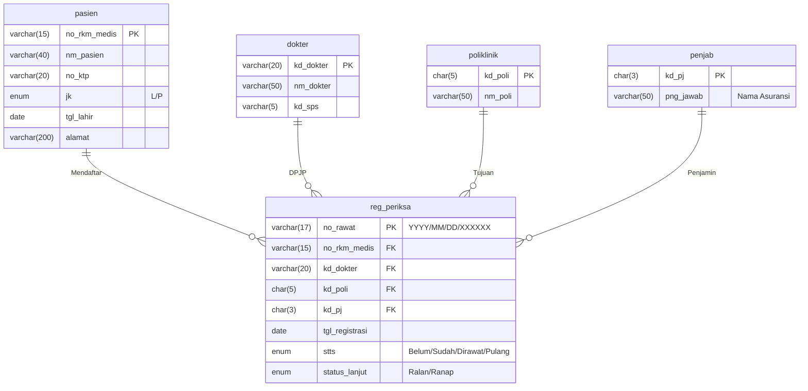
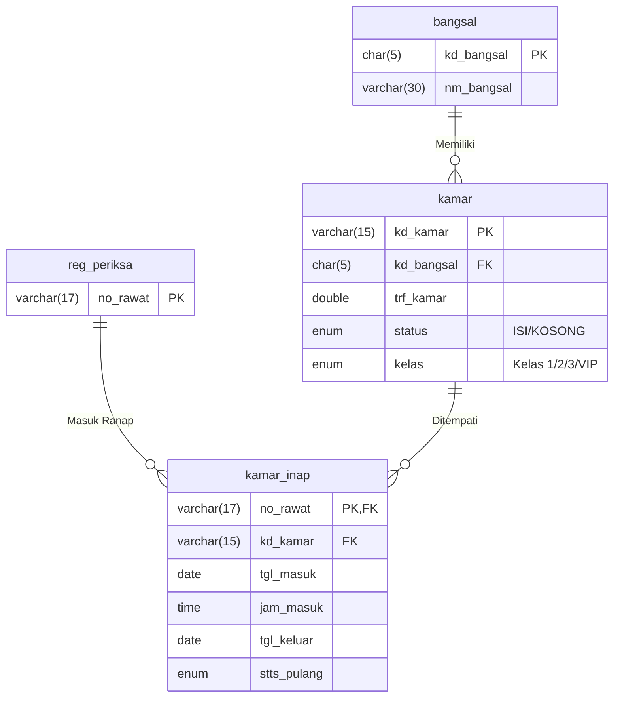
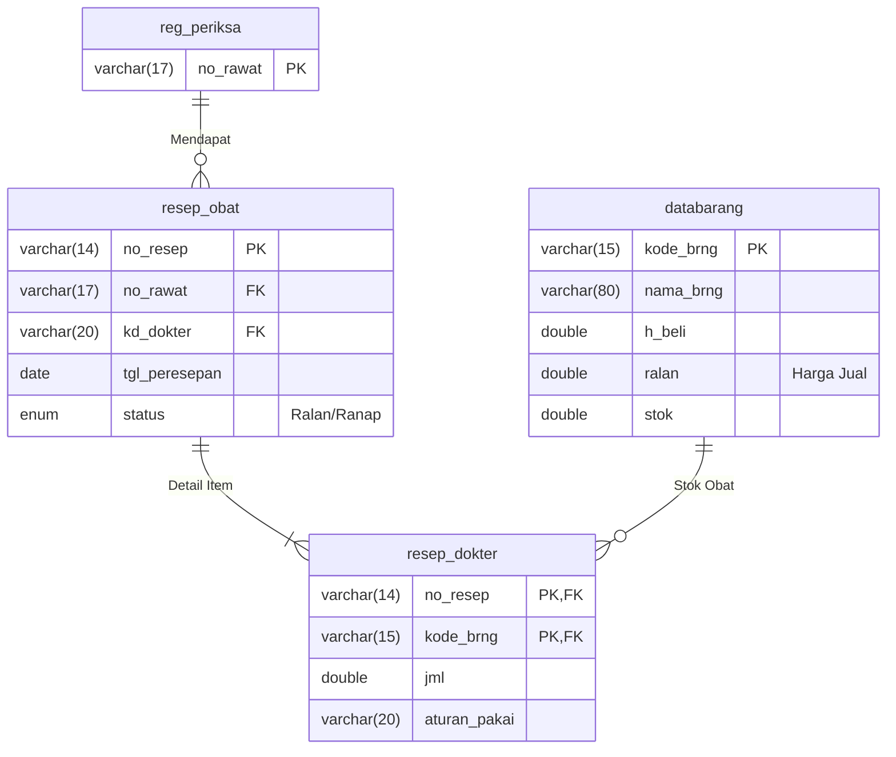
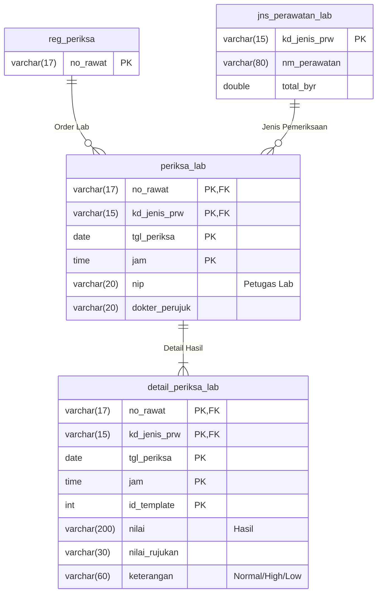

# Dokumentasi Database Faskesku ID (Live Schema)

Dokumen ini menjelaskan struktur database **Live (MySQL)** dari aplikasi Faskesku ID.
Database ini berbasis **SIMRS Khanza** dengan total **1.114 tabel**. Dokumen ini menyajikan **Entity Relationship Diagram (ERD)** per modul untuk memudahkan pemahaman.

## 1. Modul Pendaftaran & Pelayanan (Core)

Modul ini menangani alur utama pasien mulai dari registrasi hingga masuk ke poli.



---

## 2. Modul Rawat Inap

Menangani manajemen bangsal, kamar, dan perawatan inap pasien.



---

## 3. Modul Farmasi (Resep & Obat)

Menangani peresepan obat dari dokter ke pasien.



---

## 4. Modul Laboratorium

Menangani permintaan dan hasil pemeriksaan lab.



---

## 5. Modul Akuntansi (Keuangan)

Menangani pencatatan jurnal keuangan, billing pasien, dan buku besar.

```mermaid
erDiagram
    jurnal {
        varchar(20) no_jurnal PK
        varchar(30) no_bukti
        date tgl_jurnal
        time jam_jurnal
        enum jenis "U/P"
        varchar(350) keterangan
    }
    detailjurnal {
        varchar(20) no_jurnal FK
        varchar(15) kd_rek FK
        double debet
        double kredit
    }
    rekening {
        varchar(15) kd_rek PK "Chart of Account"
        varchar(100) nm_rek
        enum tipe "N/M/R"
        enum balance "D/K"
    }
    billing {
        int noindex PK
        varchar(17) no_rawat FK
        date tgl_byr
        varchar(50) no
        varchar(200) nm_perawatan
        char(1) pemisah "Kode Kategori Item"
        double biaya
        double jumlah
        double tambahan
        double totalbiaya
        enum status "Laborat/Radiologi/Operasi/Obat/Ranap/Ralan/Kamar/Administrasi/Registrasi/Tambahan/Potongan/Tagihan"
    }
    nota_jalan {
        varchar(17) no_rawat PK
        varchar(17) no_nota UNI
        date tanggal
        time jam
    }
    nota_inap {
        varchar(17) no_rawat PK
        varchar(17) no_nota UNI
        date tanggal
        time jam
        double Uang_Muka
    }
    reg_periksa {
        varchar(17) no_rawat PK
    }

    jurnal ||--|{ detailjurnal : "Memiliki Detail"
    rekening ||--o{ detailjurnal : "Digunakan di"
    reg_periksa ||--o{ billing : "Tagihan Pasien"
    reg_periksa ||--o{ nota_jalan : "Nota Ralan"
    reg_periksa ||--o{ nota_inap : "Nota Ranap"
```

### Analisis Tabel `billing`
Tabel `billing` adalah tabel **Agregasi / Snapshot** yang berfungsi sebagai rincian final tagihan pasien saat pembayaran dilakukan.

*   **Fungsi Utama:** Menyimpan snapshot harga dan item pelayanan (Tindakan, Obat, Kamar, Admin) pada saat transaksi ditutup/dibayar. Ini mencegah perubahan nominal tagihan di masa depan jika master harga berubah.
*   **Cara Kerja:**
    1.  Saat pasien dilayani, data masuk ke tabel operasional (`resep_dokter`, `rawat_jl_dr`, `periksa_lab`).
    2.  Saat Kasir membuat **Nota/Kuitansi**, sistem akan menarik data dari tabel operasional tersebut.
    3.  Sistem menghitung total dan menyimpan rinciannya ke tabel `billing` baris per baris.
    4.  Tabel ini kemudian menjadi sumber data untuk cetak kuitansi dan laporan pendapatan harian.
*   **Kolom Penting (sesuai schema_dump):**
    *   `no_rawat`: Kunci tamu ke registrasi pasien.
    *   `tgl_byr`: Tanggal transaksi.
    *   `no`: Kode/keterangan tambahan per item (digunakan pada beberapa laporan).
    *   `nm_perawatan`: Nama item (misal: "Paracetamol 500mg", "Jasa Dokter Umum").
    *   `biaya`: Harga satuan item saat disnapshat.
    *   `jumlah`: Kuantitas item.
    *   `tambahan`: Biaya lain-lain per baris (jika ada).
    *   `totalbiaya`: Biaya total per baris setelah perhitungan.
    *   `pemisah`: Kode kategori item (char(1), untuk pemisahan kelompok).
    *   `status`: Kategori enum lengkap (contoh: `Laborat`, `Radiologi`, `Operasi`, `Obat`, `Ralan Dokter`, `Ralan Paramedis`, `Kamar`, `Registrasi`, `Administrasi`, `Tambahan`, `Potongan`, `Tagihan`, dll.).

### Catatan Relasi & Kunci
* `nota_jalan`: PK di `no_rawat`, `no_nota` bernilai unik; menyimpan `tanggal` dan `jam`. Umumnya 1 kunjungan (no_rawat) → 1 nota.
* `nota_inap`: PK di `no_rawat`, `no_nota` unik, menyimpan `tanggal`, `jam`, serta `Uang_Muka` (deposit).
* `detailjurnal`: berelasi ke `jurnal` dan `rekening` untuk pencatatan ke buku besar.

---

### Proses Posting Jurnal (Ringkasan dari `public/Jurnal.java`)

Kode Java `keuangan.Jurnal` menangani proses posting jurnal dari tabel staging (`tampjurnal`) ke tabel permanen (`jurnal` dan `detailjurnal`). Berikut alur lengkapnya berdasarkan pembacaan file sumber:

- Validasi awal mengambil agregat dari `tampjurnal`:
  - `SELECT COUNT(*) AS jml, CURRENT_DATE() AS tanggal, CURRENT_TIME() AS jam, SUM(debet) AS debet, SUM(kredit) AS kredit FROM tampjurnal`
  - Jika `debet != kredit`, proses dibatalkan dengan pesan "Debet dan Kredit tidak sama" (double-entry harus seimbang).
  - Jika `jml` (jumlah baris) = 0, proses diabaikan (tidak ada data untuk diposting).
- Penomoran `no_jurnal` per tanggal:
  - Format: `JRYYYYMMDD######` (prefix `JR` + tanggal tanpa tanda `-` + 6 digit nomor urut harian).
  - Diambil menggunakan: `SELECT IFNULL(MAX(CONVERT(RIGHT(jurnal.no_jurnal,6),SIGNED)),0) FROM jurnal WHERE tgl_jurnal = <tanggal_hari_ini>` lalu di-increment.
- Insert header jurnal:
  - `INSERT INTO jurnal(no_jurnal, no_bukti, tgl_jurnal, jam_jurnal, jenis, keterangan) VALUES (?,?,?,?,?,?)`
  - Field `jenis` dan `keterangan` diteruskan dari pemanggil metode `simpanJurnal(nobukti, jenis, keterangan)`.
- Insert detail dari staging:
  - `SELECT kd_rek, nm_rek, debet, kredit FROM tampjurnal`
  - Untuk setiap baris: `INSERT INTO detailjurnal(no_jurnal, kd_rek, debet, kredit) VALUES (?,?,?,?)`.
- Pembersihan staging:
  - Setelah sukses, `DELETE FROM tampjurnal` agar staging kosong untuk transaksi berikutnya.
- Nilai balik: boolean `sukses` (true jika seluruh langkah berhasil dan jurnal tersimpan).

Catatan implementasi:
- Terdapat usaha penyisipan ulang jika percobaan insert pertama gagal (mengulang pengambilan nomor dan eksekusi INSERT). Ini mengantisipasi kondisi race pada penomoran harian.
- `tampjurnal` berfungsi sebagai keranjang sementara (staging) tempat aplikasi menyiapkan pasangan akun-debet/kredit sebelum diposting.

#### Struktur Tabel Staging Jurnal
Mengacu pada schema live:

- `tampjurnal`
  - `kd_rek` char(15) [PK]
  - `nm_rek` varchar(100)
  - `debet` double
  - `kredit` double
- `tampjurnal2`
  - Struktur identik dengan `tampjurnal` (kd_rek, nm_rek, debet, kredit).

Penggunaan umum:
- `tampjurnal` dipakai oleh proses posting utama yang dirangkum di `Jurnal.java`.
- `tampjurnal2` tersedia sebagai staging paralel untuk kebutuhan lain atau komposisi jurnal yang berbeda (misal proses batch/rekonsiliasi), meskipun tidak langsung digunakan di `Jurnal.java` yang dibahas.

#### Praktik Baik (Best Practices)
- Pastikan setiap transaksi yang dimuat ke `tampjurnal` selalu menghasilkan total `debet == kredit` sebelum memanggil posting, untuk menjaga integritas pembukuan berpasangan.
- Hindari menyimpan `nm_rek` sebagai sumber kebenaran; gunakan `kd_rek` sebagai kunci utama dan ambil nama dari master `rekening` saat perlu ditampilkan.
- Terapkan audit trail di level aplikasi untuk mencatat sumber transaksi yang mengisi `tampjurnal` (mis. nomor nota/kunjungan) sebelum posting.

#### Contoh Query Pemeriksaan
- Mengecek keseimbangan staging saat ini:
  ```sql
  SELECT SUM(debet) AS total_debet, SUM(kredit) AS total_kredit, COUNT(*) AS jml
  FROM tampjurnal;
  ```
- Menelusuri detail staging sebelum posting:
  ```sql
  SELECT t.kd_rek, r.nm_rek, t.debet, t.kredit
  FROM tampjurnal t
  LEFT JOIN rekening r ON r.kd_rek = t.kd_rek
  ORDER BY t.kd_rek;
  ```

---

## 6. Alur Billing End-to-End (Tagihan & Pembayaran)

Diagram ini menggambarkan bagaimana data dari berbagai unit layanan (Poli, Lab, Farmasi) bermuara menjadi tagihan dan pembayaran.

```mermaid
erDiagram
    %% INPUT MEDIS & LAYANAN
    rawat_jl_dr {
        varchar(17) no_rawat FK
        varchar(15) kd_jenis_prw FK
        double tarif_tindakandr
    }
    resep_dokter {
        varchar(14) no_resep FK
        varchar(15) kode_brng FK
        double jml
    }
    periksa_lab {
        varchar(17) no_rawat FK
        double total_byr
    }
    periksa_radiologi {
        varchar(17) no_rawat FK
        double total_byr
    }
    kamar_inap {
        varchar(17) no_rawat FK
        double trf_kamar
        double lama
    }

    %% PROSES BILLING
    reg_periksa {
        varchar(17) no_rawat PK
    }
    billing {
        int noindex PK
        varchar(17) no_rawat FK
        varchar(200) nm_perawatan
        double biaya
        double jumlah
        double totalbiaya
        char(1) pemisah
        enum status
    }
    nota_jalan {
        varchar(17) no_rawat PK
        varchar(17) no_nota UNI
    }
    nota_inap {
        varchar(17) no_rawat PK
        varchar(17) no_nota UNI
        double Uang_Muka
    }

    %% PEMBAYARAN & TAGIHAN KHUSUS
    tagihan_sadewa {
        varchar(17) no_nota PK
        varchar(15) no_rkm_medis
        double jumlah_tagihan
        double jumlah_bayar
        enum status "Sudah/Belum"
    }
    bayar_piutang {
        varchar(17) no_rkm_medis FK
        double besar_cicilan
    }

    %% RELASI INPUT KE REGISTRASI
    reg_periksa ||--o{ rawat_jl_dr : "Tindakan Dokter"
    reg_periksa ||--o{ resep_dokter : "Obat Farmasi"
    reg_periksa ||--o{ periksa_lab : "Pemeriksaan Lab"
    reg_periksa ||--o{ periksa_radiologi : "Pemeriksaan Radiologi"
    reg_periksa ||--o{ kamar_inap : "Akomodasi Kamar"

    %% RELASI KE BILLING (AGREGASI)
    reg_periksa ||--o{ billing : "Rincian Tagihan (Snapshot)"
    reg_periksa ||--o{ nota_jalan : "Nota Final (Ralan)"
    reg_periksa ||--o{ nota_inap : "Nota Final (Ranap)"
    
    %% RELASI KE PEMBAYARAN
    nota_jalan ||--|| tagihan_sadewa : "Integrasi Payment"
    reg_periksa ||--o{ bayar_piutang : "Cicilan Piutang"
```

### Penjelasan Alur
1.  **Input Layanan:** Dokter/Perawat menginput tindakan di `rawat_jl_dr` (Ralan) atau `rawat_inap_dr` (Ranap). Farmasi menginput `resep_dokter`. Lab & Radiologi menginput hasil periksa.
2.  **Kalkulasi Billing:** Saat pasien hendak pulang, sistem kasir menarik semua data layanan tersebut.
3.  **Snapshot Billing:** Rincian biaya disimpan ke tabel `billing` agar statis (tidak berubah meski tarif master naik).
4.  **Penerbitan Nota:** Dibuat record di `nota_jalan` (PK: `no_rawat`, `no_nota` unik) untuk Ralan, atau `nota_inap` untuk Ranap, sebagai bukti transaksi sah.
5.  **Integrasi Pembayaran:** Data nota masuk ke `tagihan_sadewa` untuk pencatatan status pembayaran (Lunas/Belum) dan integrasi dengan gateway pembayaran jika ada.

### Checklist Implementasi (Laravel Model & Relasi)
- RegPeriksa hasMany Billing (foreignKey: `no_rawat`).
- RegPeriksa hasOne NotaJalan dan hasOne NotaInap (foreignKey: `no_rawat`).
- Billing belongsTo RegPeriksa.
- Jurnal hasMany DetailJurnal; DetailJurnal belongsTo Jurnal dan belongsTo Rekening.
- Rekening sebagai master Chart of Account.

### Contoh Query Praktis
- Ringkasan tagihan per kategori status:
  ```sql
  SELECT status, SUM(totalbiaya) AS total
  FROM billing
  WHERE no_rawat = ?
  GROUP BY status
  ORDER BY status;
  ```
- Memuat nota ralan beserta konteks kunjungan:
  ```sql
  SELECT nj.*, rp.no_rkm_medis, d.nm_dokter, p.nm_pasien, pl.nm_poli, pj.png_jawab
  FROM nota_jalan nj
  JOIN reg_periksa rp ON nj.no_rawat = rp.no_rawat
  JOIN pasien p ON rp.no_rkm_medis = p.no_rkm_medis
  JOIN dokter d ON rp.kd_dokter = d.kd_dokter
  JOIN poliklinik pl ON rp.kd_poli = pl.kd_poli
  JOIN penjab pj ON rp.kd_pj = pj.kd_pj
  WHERE nj.no_rawat = ?;
  ```

---

## 7. Modul Kepegawaian (HRD)

Menangani data pegawai, jadwal shift, dan absensi.

```mermaid
erDiagram
    pegawai {
        int id PK
        varchar(20) nik UNI
        varchar(50) nama
        varchar(25) jbtn
        char(4) departemen FK
        varchar(15) bidang FK
        double gapok "Gaji Pokok"
    }
    departemen {
        char(4) dep_id PK
        varchar(25) nama
    }
    bidang {
        varchar(15) nama PK
    }
    jadwal_pegawai {
        int id PK,FK
        year tahun PK
        enum bulan PK
        enum h1 "Shift Tgl 1"
        enum h2 "Shift Tgl 2"
        enum h30 "Shift Tgl 30"
    }
    presensi {
        int id PK,FK
        date tgl PK
        enum jns "HR/HB"
        int lembur
    }

    pegawai ||--o{ jadwal_pegawai : "Punya Jadwal"
    pegawai ||--o{ presensi : "Melakukan Absensi"
    departemen ||--o{ pegawai : "Memiliki Staff"
    bidang ||--o{ pegawai : "Bagian Dari"
    }
```

---

## 8. Ringkasan Tabel Lainnya

Karena jumlah tabel sangat banyak (1.114), berikut adalah prefix tabel untuk modul lainnya:

| Prefix | Modul | Fungsi Utama |
| :--- | :--- | :--- |
| `ak_`, `akun_` | **Akuntansi** | Jurnal, Buku Besar, Neraca |
| `antri` | **Antrean** | Manajemen antrean loket, poli, farmasi |
| `bridging` | **BPJS VClaim** | SEP, Rujukan, Klaim |
| `pcare` | **BPJS PCare** | Pendaftaran & Kunjungan FKTP |
| `utd` | **Bank Darah** | Stok darah, Donor, Crossmatch |
| `zis` | **Zakat & Sosial** | Penerima bantuan, Donatur |
| `satu_sehat` | **Integrasi Kemenkes** | Mapping ID SATUSEHAT |

## Catatan Teknis
*   **Database Engine:** MySQL (InnoDB & MyISAM).
*   **Primary Keys:** Mayoritas menggunakan `varchar` manual (bukan auto-increment).
*   **Foreign Keys:** Relasi antar tabel dijaga secara logik aplikasi (Logical Relationship), tidak selalu ada constraint fisik di database (terutama pada tabel MyISAM lama).

---

## Catatan PPN (Pajak Pertambahan Nilai)

Ringkasan ini bertujuan menstandarkan pemahaman dan penggunaan PPN lintas modul (Akuntansi, Farmasi, Kasir) agar pengembangan selanjutnya konsisten.

Hal-hal penting terkait kolom PPN di database:

- akun_bayar
  - ppn (double): persentase PPN default untuk metode pembayaran tertentu. Contoh: 11 berarti 11%.
  - kd_rek (varchar(15)): relasi ke tabel rekening untuk pencatatan jurnal saat pembayaran.
  - nama_bayar direferensikan oleh beberapa tabel pembayaran (detail_nota_jalan, detail_nota_inap, deposit).
  - Catatan implementasi di data live: nilai yang sering muncul adalah 0, 1, 2 yang dimaknai sebagai persentase (0%/1%/2%). Pada praktik lapangan, kolom ini kerap dipakai sebagai surcharge/biaya admin/MDR per metode bayar, bukan PPN nasional 11%. Sesuaikan kebijakan lokal.

- pembelian
  - ppn (double): nilai nominal PPN per faktur pembelian (bukan persentase). Disimpan bersamaan dengan total dan potongan.
  - kd_rek (varchar(15)): relasi ke rekening (umumnya akun hutang/usaha atau bank/kas yang digunakan).

- detail_nota_jalan dan detail_nota_inap
  - besarppn (double): nilai nominal PPN yang dibebankan pada saat pembayaran per nota.
  - nama_bayar (varchar(50)): relasi logik ke akun_bayar untuk metode pembayaran.

- deposit
  - besarppn (double): nilai nominal PPN terkait transaksi deposit.

- set_harga_obat
  - ppn (enum 'Yes','No'): flag konfigurasi penentuan harga jual obat apakah memasukkan PPN atau tidak dalam kalkulasi harga.
  - setharga, hargadasar: kontrol sumber penetapan harga jual (Umum/Jenis/Barang dan Harga Beli/Harga Diskon).

- Unit Transfusi Darah (UTD)
  - utd_penyerahan_darah.besarppn (double): PPN nominal pada penyerahan darah.

Catatan akun dan jurnal PPN yang direkomendasikan:

- Gunakan dua akun PPN di Chart of Account (rekening):
  - PPN Masukan (aktiva lancar): didebet saat pembelian barang/jasa kena pajak.
  - PPN Keluaran (kewajiban lancar): dikredit saat penjualan barang/jasa kena pajak.
- Akun-akun ini tidak menjadi FK langsung di tabel transaksi, tetapi dipakai saat posting jurnal oleh aplikasi.

Perilaku implementasi saat ini (observasi kode):

- Modul Pembelian
  - Nilai PPN dihitung di sisi frontend dan disimpan sebagai nominal ke kolom pembelian.ppn.
  - Endpoint dropdown akun bayar (getAkunBayar) saat ini hanya mengembalikan nama_bayar dan kd_rek; kolom ppn dari akun_bayar belum ikut dikirim.

- Modul Farmasi
  - Konfigurasi set_harga_obat.ppn (Yes/No) digunakan oleh backend untuk menentukan apakah harga jual obat mengikutsertakan PPN dalam kalkulasi mass update harga.

Rekomendasi standarisasi ke depan:

- Backend (API)
  - Sertakan kolom akun_bayar.ppn pada response endpoint daftar akun bayar (mis. getAkunBayar) sebagai persentase default.
  - Pertahankan pembelian.ppn sebagai nominal rupiah PPN per faktur (hasil kalkulasi akhir).

- Frontend (Kasir/Farmasi/Pembelian)
  - Prefill persentase PPN dari akun_bayar.ppn saat metode bayar dipilih; tetap bisa diubah manual jika diperlukan.
  - Jika set_harga_obat.ppn = 'Yes', definisikan dengan jelas apakah harga jual yang ditampilkan sudah termasuk PPN (inclusive) atau belum (exclusive), dan konsisten di seluruh UI.

- Jurnal Otomatis
  - Pembelian: Debet Persediaan/Barang (harga dasar), Debet PPN Masukan (nominal), Kredit Hutang/Bank (total bersih setelah potongan).
  - Penjualan: Debet Piutang/Bank, Kredit Pendapatan (harga dasar), Kredit PPN Keluaran (nominal).

- Validasi & Pencegahan double counting
  - Hindari menjumlahkan PPN dua kali: pastikan hanya satu sumber kebenaran untuk nominal PPN saat posting (mis. pembelian.ppn atau akumulasi baris detail), dan konsisten antara inclusive/exclusive.

Contoh query pemeriksaan cepat:

- Daftar metode bayar beserta persentase PPN default
  - SELECT nama_bayar, kd_rek, ppn FROM akun_bayar ORDER BY nama_bayar;

- Cek nominal PPN pada faktur pembelian terbaru
  - SELECT no_faktur, ppn, tgl_beli FROM pembelian ORDER BY tgl_beli DESC LIMIT 20;

Dengan catatan ini, pengembangan selanjutnya diharapkan:

- Memiliki satu referensi jelas tentang lokasi kolom PPN dan maknanya (persentase vs nominal).
- Menyederhanakan integrasi UI dan posting jurnal akuntansi.
- Mengurangi inkonsistensi perhitungan PPN antar modul.

---

## 9. Pengaturan Rekening (COA Mapping dari SIMRS Khanza)

Ringkasan ini merangkum fungsionalitas dialog Java "DlgPengaturanRekening" (aplikasi Swing SIMRS Khanza) yang digunakan untuk memetakan akun-akun Chart of Account (COA) ke berbagai proses/pos transaksi. Tujuannya agar implementasi di aplikasi Faskesku ID konsisten dan mudah dirawat.

### Struktur UI (berdasarkan DlgPengaturanRekening)
- Terdiri dari 3 tab utama:
  1) Pengaturan Umum
  2) Tarif Ralan (Rawat Jalan)
  3) Tarif Ranap (Rawat Inap)

- Pengaturan Umum:
  - Tabel 5 kolom: "Letak Akun Rekening", "Kode Akun", "Nama Akun", "Tipe", "Balance".
  - Memetakan akun-akun umum/induk ke lokasi penggunaan dalam sistem.

- Tarif Ralan:
  - Tabel dengan pasangan kolom Kode/Nama Akun untuk setiap pos transaksi layanan Ralan.
  - Pos-pos utama yang dimapping meliputi (contoh, tidak terbatas):
    - Tindakan Ralan: Pendapatan Tindakan, Beban Jasa Medis Dokter, Utang Jasa Medis Dokter, Beban Jasa Medis Paramedis, Utang Jasa Medis Paramedis, Beban KSO, Utang KSO, HPP Persediaan, Persediaan BHP.
    - Laborat Ralan: akun pendapatan, beban/utang jasa, KSO, HPP, persediaan BHP.
    - Radiologi Ralan: akun pendapatan, beban/utang jasa, KSO, HPP, persediaan BHP.
    - Operasi Ralan: akun beban/utang jasa dokter/paramedis, HPP obat operasi, persediaan obat kamar operasi.
    - Obat Ralan: HPP obat rawat jalan, persediaan obat rawat jalan.

- Tarif Ranap:
  - Struktur mirip Ralan namun untuk layanan Rawat Inap; menambahkan konteks Ruang/Kelas.
  - Termasuk pengaturan untuk Uang Muka Ranap, Piutang Pasien Ranap, Bayar Piutang Pasien, Service Ranap, dan pos-pos pendapatan/beban/utang/HPP/persediaan per jenis layanan (Tindakan, Laborat, Radiologi, Operasi, Obat).

- Fitur UI penting (Java):
  - Penggunaan DefaultTableModel dengan lebar kolom yang disetel rinci per tab.
  - Renderer WarnaTable untuk pewarnaan baris.
  - JPopupMenu dengan aksi "Copy Rekening" untuk menyalin Kode/Nama Akun antar sel.
  - Integrasi DlgRekeningTahun sebagai pemilih akun (memilih kd_rek serta nm_rek dari daftar COA).
  - Tombol Update (Alt+U) dan Keluar (Alt+K).

### Contoh Kategori Pos Akuntansi yang Dimapping
Berikut contoh kumpulan kategori yang muncul di kode Java (disederhanakan):
- Ralan/Ranap per jenis layanan: Tindakan, Laborat, Radiologi, Operasi, Obat, Registrasi, Tambahan, Potongan.
- Akun granular per layanan: Pendapatan, Beban Jasa Medis Dokter, Utang Jasa Medis Dokter, Beban Jasa Medis Paramedis, Utang Jasa Medis Paramedis, Beban KSO, Utang KSO, HPP Persediaan, Persediaan BHP.
- Persediaan & HPP: HPP Obat (rawat jalan/operasi/ranap), Persediaan Obat, Persediaan BHP (Laborat/Radiologi, dll.).
- Piutang & Kontra-Piutang: Piutang Obat/Toko/Pasien, Kontra Piutang, Retur Piutang, Kontra Retur Piutang.
- Pembelian & Retur: Pengadaan Obat/IPSRS/Dapur/Toko, Pemesanan & Kontra Pemesanan, Bayar Pemesanan, Retur ke Suplier, Retur dari Pembeli, Kontra Retur.
- UTD (Bank Darah): Penyerahan Darah, Pengambilan UTD, Kontra Pengambilan UTD, Pengambilan Penunjang UTD, Kontra Pengambilan Penunjang UTD.
- PPN & Lainnya: PPN Masukan/Keluaran, Diskon Piutang, Piutang Tidak Terbayar, Lebih Bayar Piutang.

Catatan: daftar di atas menunjukkan cakupan luas pos akuntansi yang dipetakan dalam sistem, sehingga modul Pengaturan Rekening di aplikasi perlu fleksibel dan extensible.

### Rekomendasi Implementasi di Aplikasi Faskesku ID
Untuk menyelaraskan dengan fungsi di atas, disarankan membuat modul "Pengaturan Rekening" yang menyediakan:

1) Antarmuka (Frontend)
- 3 bagian (dapat berupa tab atau accordion): Pengaturan Umum, Tarif Ralan, Tarif Ranap.
- Setiap baris pos memiliki pemilih akun berbasis SearchableSelect (mengambil data dari endpoint Rekening: kd_rek — nm_rek).
- Fitur salin akun (copy-paste) antar kolom seperti JPopupMenu "Copy Rekening" di Java.
- Validasi: pos-pos kunci tidak boleh kosong.
- UI mengikuti panduan di UI_UX_IMPROVEMENTS_GUIDE.md (card, sticky header, hover states, keyboard shortcuts bila diperlukan).

2) Endpoint API (Backend)
- GET /api/akutansi/pengaturan-rekening?scope=umum|ralan|ranap → mengambil konfigurasi mapping.
- PUT /api/akutansi/pengaturan-rekening → menyimpan perubahan (batch update) dengan validasi referensi kd_rek.
- Integrasi dengan endpoint /api/akutansi/rekening (master COA) untuk daftar akun.

3) Desain Tabel (Opsional, bila belum ada di skema)
- Opsi A: Satu tabel generik, contoh: `pengaturan_rekening`
  - Kolom kunci: id, scope (enum: umum/ralan/ranap), kategori (varchar), subkategori (varchar nullable), jenis_pos (enum: pendapatan/beban/utang/kso/hpp/persediaan/...), kd_rek (varchar(15) FK → rekening.kd_rek), keterangan.
- Opsi B: Tabel spesifik meniru struktur Java
  - `pengaturan_rekening_umum` dengan kolom: letak (varchar), kd_rek (FK), nm_rek, tipe, balance.
  - `pengaturan_rekening_ralan` dan `pengaturan_rekening_ranap` menyimpan pasangan akun per pos-per layanan (dapat dinormalisasi menjadi baris per pos untuk memudahkan perawatan).

4) Dampak ke Jurnal Otomatis
- Pengisian mapping menjadi sumber kebenaran saat posting jurnal atas transaksi layanan (pendapatan/beban/utang) dan pergerakan persediaan/HPP.
- Sinkronkan dengan Catatan PPN: pastikan akun PPN Masukan/Keluaran tersedia di Pengaturan Umum.

5) Checklist Teknis
- Seeder awal untuk pos-pos minimal agar UI dapat digunakan langsung.
- Audit trail perubahan mapping (siapa/kapan/apa yang diubah).
- Fallback default jika ada pos yang belum dipetakan (misal, blokir posting atau tampilkan peringatan di UI).

Dengan ringkasan ini, modul Pengaturan Rekening di Faskesku ID dapat dibangun selaras dengan praktik yang telah berjalan di SIMRS Khanza, sekaligus lebih modern dan terstruktur untuk kebutuhan web (Laravel + React/Inertia).

---

## 10. Tabel `temporary` dan `temporary2` (Scratch Tables)

Di dalam skema live terdapat dua tabel generik yang sering digunakan sebagai penampung sementara untuk keperluan laporan atau proses batch: `temporary` dan `temporary2`. Keduanya tidak memiliki relasi FK yang ketat dan kolomnya bersifat general-purpose.

### Struktur (mengacu pada schema_dump.txt)
- `temporary`
  - `no` int(100)
  - `temp1` s.d. `temp15` bertipe `varchar(1000)`
  - `temp16` s.d. `temp37` bertipe `varchar(100)`
- `temporary2`
  - `no` int(100)
  - `temp1` s.d. `temp100` bertipe `varchar(100)`

Tujuan dan Pola Penggunaan:
- Menyimpan data hasil agregasi atau intermediate (mis. materialisasi untuk cetak laporan harian, rekap unit layanan) agar query kompleks menjadi sederhana saat diakses oleh modul cetak.
- Menjadi buffer antar proses saat perlu menggabungkan data dari banyak tabel operasional (mis. join besar lintas modul) sebelum disajikan.

Karakteristik & Catatan Penting:
- Tidak ada penamaan kolom yang semantik; penamaan `tempN` menuntut dokumentasi di level aplikasi mengenai arti setiap kolom untuk setiap skenario penggunaan.
- Tidak cocok sebagai penyimpanan permanen. Disarankan mengosongkan (truncate/delete) sebelum dan sesudah dipakai oleh suatu proses agar tidak terjadi kebocoran data antar sesi.
- Kolom `no` lazim dipakai sebagai penanda urutan atau sesi. Jika ada beberapa proses paralel, tambah "namespace"/identifier sesi di salah satu kolom `temp*` untuk mencegah benturan.
- Karena bertipe `varchar`, perlu perhatian pada konversi tipe (angka/tanggal) saat melakukan perhitungan.

Best Practices:
- Buat helper/DAO khusus untuk operasi pada tabel temporary agar skema penulisan dan pembersihan konsisten.
- Dokumentasikan mapping arti `temp1..tempN` per laporan/proses di dalam kode (comment) dan di wiki internal.
- Untuk kasus yang sering, pertimbangkan membuat tabel tujuan khusus dengan kolom bernama semantik ketimbang bergantung pada temporary generik.

Contoh Alur Pemakaian (Pseudo-SQL):
```sql
-- 1) Bersihkan buffer untuk sesi laporan harian kasir
DELETE FROM temporary WHERE no = 1;

-- 2) Isi data agregasi dari berbagai tabel operasional
INSERT INTO temporary(no, temp1, temp2, temp3, temp4)
SELECT 1 AS no,
       rp.no_rawat AS temp1,
       p.nm_pasien AS temp2,
       SUM(b.totalbiaya) AS temp3,
       DATE_FORMAT(b.tgl_byr, '%Y-%m-%d') AS temp4
FROM reg_periksa rp
JOIN pasien p ON p.no_rkm_medis = rp.no_rkm_medis
JOIN billing b ON b.no_rawat = rp.no_rawat
WHERE b.tgl_byr = CURDATE()
GROUP BY rp.no_rawat, p.nm_pasien;

-- 3) Konsumsi oleh modul cetak
SELECT temp1 AS no_rawat, temp2 AS nm_pasien, temp3 AS total, temp4 AS tanggal
FROM temporary
WHERE no = 1
ORDER BY temp2;
```

Dengan memahami sifat generik kedua tabel ini, tim dapat menggunakan `temporary`/`temporary2` secara aman untuk kebutuhan ad-hoc tanpa mengganggu integritas data permanen.
## Ringkasan Fungsi Tabel Temporary dan Contoh Alur Pengisian

Delapan tabel temporary berikut dipakai sebagai buffer/scratch untuk keperluan laporan, cetak, integrasi pembayaran, atau antrian. Semuanya bersifat sementara (ephemeral) dan aman dipakai per sesi jika kita disiplin membersihkan sebelum dan sesudah pemakaian.

- temporary
  - PK/logical key: no (int)
  - Kolom: temp1..temp37 (temp1..temp15 lebih lebar, cocok untuk teks panjang)
  - Tujuan umum: buffer serbaguna untuk laporan/cetak yang tidak punya tabel semantik khusus.
- temporary2
  - PK/logical key: no (int)
  - Kolom: temp1..temp100 (semua panjang 100 char)
  - Tujuan umum: buffer serbaguna dengan kolom lebih banyak untuk kebutuhan kompleks.
- temporary_bayar_ralan
  - PK/logical key: no (int)
  - Kolom: temp1..temp17 (temp2 sedikit lebih panjang)
  - Tujuan: staging pencetakan pembayaran Rawat Jalan (nota ralan, rincian item, total, dsb.).
- temporary_bayar_ranap
  - PK/logical key: no (int)
  - Kolom: temp1..temp17 (temp2 sedikit lebih panjang)
  - Tujuan: staging pencetakan pembayaran Rawat Inap.
- temporary_payment
  - PK/logical key: no (int)
  - Kolom: temp1..temp37 (temp1..temp15 lebar)
  - Tujuan: staging ringkasan transaksi/pembayaran generik (gateway payment, rekap pembayaran, dsb.).
- temporary_resep
  - PK/logical key: no (int)
  - Kolom: temp1..temp37 (temp1..temp15 lebar)
  - Tujuan: staging cetak resep/etiket, daftar item obat dan instruksi.
- temppanggilnorawat
  - Kolom: no_rawat (varchar)
  - Tujuan: queue pemanggilan berdasarkan nomor rawat (antrian Loket/Apotek/Lab, dsb.).
- temppanggilrm
  - Kolom: no_rkm_medis (varchar, PK)
  - Tujuan: queue pemanggilan berdasarkan nomor rekam medis.

Pola pemakaian aman (generik):
1) Tentukan session_id (integer) unik per proses cetak (contoh: epoch millis). 
2) Bersihkan tabel untuk session_id tersebut (delete by no). 
3) Isi baris-baris yang diperlukan (header, detail, total) dengan urutan temp1..tempN yang disepakati oleh laporan/printer. 
4) Jalankan cetak/preview menggunakan session_id sebagai filter. 
5) Bersihkan lagi untuk mencegah kebocoran data.

Contoh alur SQL pengisian (generik, sesuaikan tempN dengan kebutuhan cetak):

-- Session unik untuk proses cetak
SET @sid := FLOOR(UNIX_TIMESTAMP(NOW())*1000);

-- Rawat Jalan: nota ralan
DELETE FROM temporary_bayar_ralan WHERE no = @sid;
INSERT INTO temporary_bayar_ralan (no, temp1, temp2, temp3, temp4, temp5, temp6, temp7)
VALUES
  (@sid, 'NO.RAWAT', 'NAMA PASIEN', 'KODE TARIF', 'NAMA TINDAKAN', 'QTY', 'HARGA', 'SUBTOTAL');
-- Tambah baris detail lain sesuai kebutuhan

-- Rawat Inap: nota ranap
DELETE FROM temporary_bayar_ranap WHERE no = @sid;
INSERT INTO temporary_bayar_ranap (no, temp1, temp2, temp3, temp4, temp5, temp6, temp7)
VALUES
  (@sid, 'NO.RAWAT', 'NAMA PASIEN', 'KELAS/KAMAR', 'KODE TARIF', 'NAMA LAYANAN', 'QTY', 'SUBTOTAL');

-- Buffer generik: temporary (teks panjang di temp1..temp15)
DELETE FROM temporary WHERE no = @sid;
INSERT INTO temporary (no, temp1, temp2, temp3)
VALUES (@sid, 'Judul Laporan', 'Subjudul / Nama Unit', 'Catatan panjang di sini...');

-- Resep/etiket
DELETE FROM temporary_resep WHERE no = @sid;
INSERT INTO temporary_resep (no, temp1, temp2, temp3, temp4)
VALUES (@sid, 'NO.RESEP', 'NAMA PASIEN', 'KODE BARANG', 'ATURAN PAKAI');

-- Integrasi Payment
DELETE FROM temporary_payment WHERE no = @sid;
INSERT INTO temporary_payment (no, temp1, temp2, temp3, temp4, temp5)
VALUES (@sid, 'ORDER_ID', 'CHANNEL', 'AMOUNT', 'STATUS', 'KETERANGAN');

-- Queue pemanggilan
TRUNCATE TABLE temppanggilnorawat;  -- atau DELETE spesifik jika multi-sesi
INSERT INTO temppanggilnorawat (no_rawat) VALUES ('2025/11/22/000001');
TRUNCATE TABLE temppanggilrm;
INSERT INTO temppanggilrm (no_rkm_medis) VALUES ('00012345');


## Helper Laravel: operasi standar untuk temporary/temporary_bayar_*

Agar konsisten dan aman dipakai per sesi, sediakan helper/service yang mengelola siklus: beginSession → purge → addRow/bulkInsert → getRows → purge. Lihat implementasi di app/Helpers/TemporaryTableHelper.php dan model-model di app/Models/.

Operasi inti yang didukung:
- beginSession(tableName, sessionId?) → menghasilkan/menetapkan sessionId integer.
- purge(tableName, sessionId) → menghapus data untuk session.
- addRow(tableName, sessionId, data) → menambah satu baris; data dapat berupa array berindeks untuk temp1..tempN atau associative ('temp5' ⇒ 'nilai').
- bulkInsert(tableName, sessionId, rows[]) → menambahkan banyak baris sekaligus.
- getRows(tableName, sessionId) → mengambil isi untuk keperluan cetak/preview.

Contoh pemakaian helper (PHP):

// Cetak nota ralan
$sid = TemporaryTableHelper::beginSession('temporary_bayar_ralan');
TemporaryTableHelper::purge('temporary_bayar_ralan', $sid);
TemporaryTableHelper::bulkInsert('temporary_bayar_ralan', $sid, [
    ['NO.RAWAT', 'NAMA PASIEN', 'KODE TARIF', 'NAMA TINDAKAN', 'QTY', 'HARGA', 'SUBTOTAL'],
    ['NO.RAWAT', 'NAMA PASIEN', 'KODE TARIF2', 'TINDAKAN LAIN', '1', '50000', '50000'],
]);
$rows = TemporaryTableHelper::getRows('temporary_bayar_ralan', $sid);
// Kirim $sid ke layer cetak/preview, lalu bersihkan
TemporaryTableHelper::purge('temporary_bayar_ralan', $sid);


## Desain Tabel Semantik Pengganti (contoh: cetak nota ralan/ranap)

Untuk proses yang sering dipakai, tabel temporary sebaiknya diganti dengan tabel semantik yang jelas agar audit dan integritas data lebih baik. Usulan desain:

- nota_snapshot
  - id (bigint, PK, auto)
  - session_id (bigint, index)
  - jenis (enum: 'ralan','ranap','resep','payment')
  - no_rawat (varchar(17), index)
  - no_rkm_medis (varchar(15), index)
  - nama_pasien (varchar(100))
  - penjamin (char(3))
  - poli_kelas_kamar (varchar(100))
  - tanggal (datetime)
  - total (double)
  - ppn (double)
  - diskon (double)
  - status (varchar(30))
  - printed_at (datetime, nullable)
  - created_by (varchar(50))
- nota_snapshot_item
  - id (bigint, PK, auto)
  - snapshot_id (bigint, FK → nota_snapshot.id, index)
  - kode_item (varchar(30))
  - nama_item (varchar(200))
  - kategori (varchar(50))
  - qty (double)
  - satuan (varchar(30))
  - harga_satuan (double)
  - subtotal (double)
  - kd_rek (varchar(15), nullable)  -- optional COA mapping
  - catatan (varchar(500), nullable)

DDL contoh (MySQL):

CREATE TABLE nota_snapshot (
  id BIGINT PRIMARY KEY AUTO_INCREMENT,
  session_id BIGINT,
  jenis ENUM('ralan','ranap','resep','payment'),
  no_rawat VARCHAR(17),
  no_rkm_medis VARCHAR(15),
  nama_pasien VARCHAR(100),
  penjamin CHAR(3),
  poli_kelas_kamar VARCHAR(100),
  tanggal DATETIME,
  total DOUBLE,
  ppn DOUBLE,
  diskon DOUBLE,
  status VARCHAR(30),
  printed_at DATETIME NULL,
  created_by VARCHAR(50)
);

CREATE TABLE nota_snapshot_item (
  id BIGINT PRIMARY KEY AUTO_INCREMENT,
  snapshot_id BIGINT,
  kode_item VARCHAR(30),
  nama_item VARCHAR(200),
  kategori VARCHAR(50),
  qty DOUBLE,
  satuan VARCHAR(30),
  harga_satuan DOUBLE,
  subtotal DOUBLE,
  kd_rek VARCHAR(15) NULL,
  catatan VARCHAR(500) NULL,
  INDEX(snapshot_id)
);

Keuntungan:
- Kolom bernama jelas → memudahkan pemahaman, validasi, dan audit.
- Riwayat sesi (session_id) dan printed_at → dapat melacak siapa/kapankah nota dicetak.
- Dapat dihubungkan dengan COA (kd_rek) untuk akuntansi otomatis.


## Tabel Temporary Lain dalam schema_dump.txt (ringkasan fungsi)

Selain delapan tabel di atas, projekt SIMRS Khanza/varian ini punya banyak tabel temporary tematik. Berikut ringkasan dari schema_dump.txt:

- temporary_booking_registrasi: buffer untuk data booking/pendaftaran sebelum commit ke tabel permanen.
- temporary_gizi: buffer untuk laporan/rekap asuhan gizi.
- temporary_grafik: buffer grafik/statistik yang akan digambar oleh report engine.
- temporary_lab: buffer hasil/permintaan pemeriksaan lab umum (bukan detail permanen), untuk cetak/preview.
- temporary_lama_pelayanan_radiologi: buffer analisis waktu layanan radiologi.
- temporary_permintaan_lab, temporary_permintaan_labmb: buffer permintaan lab (varian mikrobiologi) untuk form/cetak sebelum tersimpan final.
- temporary_permintaan_radiologi: buffer permintaan tindakan radiologi untuk cetak/preview.
- temporary_presensi: berbeda dari pola 'temp1..tempN', ini menyimpan snapshot presensi pegawai (bukan hanya buffer cetak), namun tetap bersifat sementara untuk integrasi.
- temporary_radiologi: buffer hasil/permintaan radiologi generik untuk laporan.
- temporary_resume: buffer resume medis/administrasi untuk dicetak.
- temporary_sensus_harian: buffer sensus harian ruangan/pasien untuk laporan.
- temporary_tambahan_potongan: menyimpan tambahan/potongan biaya per no_rawat sebelum diapply ke billing final.
- temporary_toko: buffer modul toko/retail (penjualan umum) untuk cetak struk/rekap.

Catatan penggunaan aman untuk seluruh temporary tematik:
- Pastikan ada session_id/logical key per proses; jangan mencampur sesi berbeda dalam satu kunci.
- Lakukan purge sebelum insert, dan purge setelah cetak selesai.
- Bila memungkinkan, migrasikan proses yang repeatable ke tabel semantik permanen seperti contoh nota_snapshot di atas.
