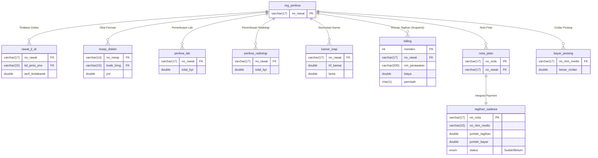

# Dokumentasi Database Faskesku ID (Live Schema)

Dokumen ini menjelaskan struktur database **Live (MySQL)** dari aplikasi Faskesku ID.
Database ini berbasis **SIMRS Khanza** dengan total **1.114 tabel**. Dokumen ini menyajikan **Entity Relationship Diagram (ERD)** per modul untuk memudahkan pemahaman.

## 1. Modul Pendaftaran & Pelayanan (Core)

Modul ini menangani alur utama pasien mulai dari registrasi hingga masuk ke poli.


---

## 2. Modul Rawat Inap

Menangani manajemen bangsal, kamar, dan perawatan inap pasien.


---

## 3. Modul Farmasi (Resep & Obat)

Menangani peresepan obat dari dokter ke pasien.


---

## 4. Modul Laboratorium

Menangani permintaan dan hasil pemeriksaan lab.


---

## 5. Modul Akuntansi (Keuangan)

Menangani pencatatan jurnal keuangan, billing pasien, dan buku besar.


### Analisis Tabel `billing`
Tabel `billing` adalah tabel **Agregasi / Snapshot** yang berfungsi sebagai rincian final tagihan pasien saat pembayaran dilakukan.

*   **Fungsi Utama:** Menyimpan snapshot harga dan item pelayanan (Tindakan, Obat, Kamar, Admin) pada saat transaksi ditutup/dibayar. Ini mencegah perubahan nominal tagihan di masa depan jika master harga berubah.
*   **Cara Kerja:**
    1.  Saat pasien dilayani, data masuk ke tabel operasional (`resep_dokter`, `rawat_jl_dr`, `periksa_lab`).
    2.  Saat Kasir membuat **Nota/Kuitansi**, sistem akan menarik data dari tabel operasional tersebut.
    3.  Sistem menghitung total dan menyimpan rinciannya ke tabel `billing` baris per baris.
    4.  Tabel ini kemudian menjadi sumber data untuk cetak kuitansi dan laporan pendapatan harian.
*   **Kolom Penting:**
    *   `no_rawat`: Kunci tamu ke registrasi pasien.
    *   `nm_perawatan`: Nama item (misal: "Paracetamol 500mg", "Jasa Dokter Umum").
    *   `biaya`: Nominal rupiah yang ditagihkan.
    *   `pemisah`: Kode kategori item (misal: `Obat`, `Tindakan`, `Registrasi`, `Kamar`). Kolom ini vital untuk pengelompokan di laporan keuangan.

---

## 6. Alur Billing End-to-End (Tagihan & Pembayaran)

Diagram ini menggambarkan bagaimana data dari berbagai unit layanan (Poli, Lab, Farmasi) bermuara menjadi tagihan dan pembayaran.



### Penjelasan Alur
1.  **Input Layanan:** Dokter/Perawat menginput tindakan di `rawat_jl_dr` (Ralan) atau `rawat_inap_dr` (Ranap). Farmasi menginput `resep_dokter`. Lab & Radiologi menginput hasil periksa.
2.  **Kalkulasi Billing:** Saat pasien hendak pulang, sistem kasir menarik semua data layanan tersebut.
3.  **Snapshot Billing:** Rincian biaya disimpan ke tabel `billing` agar statis (tidak berubah meski tarif master naik).
4.  **Penerbitan Nota:** Dibuat record di `nota_jalan` (atau `nota_inap`) sebagai bukti transaksi sah.
5.  **Integrasi Pembayaran:** Data nota masuk ke `tagihan_sadewa` untuk pencatatan status pembayaran (Lunas/Belum) dan integrasi dengan gateway pembayaran jika ada.

---

## 7. Modul Kepegawaian (HRD)

Menangani data pegawai, jadwal shift, dan absensi.

```mermaid
erDiagram
    pegawai {
        int id PK
        varchar(20) nik UNI
        varchar(50) nama
        varchar(25) jbtn
        char(4) departemen FK
        varchar(15) bidang FK
        double gapok "Gaji Pokok"
    }
    departemen {
        char(4) dep_id PK
        varchar(25) nama
    }
    bidang {
        varchar(15) nama PK
    }
    jadwal_pegawai {
        int id PK,FK
        year tahun PK
        enum bulan PK
        enum h1 "Shift Tgl 1"
        enum h2 "Shift Tgl 2"
        enum h30 "Shift Tgl 30"
    }
    presensi {
        int id PK,FK
        date tgl PK
        enum jns "HR/HB"
        int lembur
    }

    pegawai ||--o{ jadwal_pegawai : "Punya Jadwal"
    pegawai ||--o{ presensi : "Melakukan Absensi"
    departemen ||--o{ pegawai : "Memiliki Staff"
    bidang ||--o{ pegawai : "Bagian Dari"
    }
```

---

## 8. Ringkasan Tabel Lainnya

Karena jumlah tabel sangat banyak (1.114), berikut adalah prefix tabel untuk modul lainnya:

| Prefix | Modul | Fungsi Utama |
| :--- | :--- | :--- |
| `ak_`, `akun_` | **Akuntansi** | Jurnal, Buku Besar, Neraca |
| `antri` | **Antrean** | Manajemen antrean loket, poli, farmasi |
| `bridging` | **BPJS VClaim** | SEP, Rujukan, Klaim |
| `pcare` | **BPJS PCare** | Pendaftaran & Kunjungan FKTP |
| `utd` | **Bank Darah** | Stok darah, Donor, Crossmatch |
| `zis` | **Zakat & Sosial** | Penerima bantuan, Donatur |
| `satu_sehat` | **Integrasi Kemenkes** | Mapping ID SATUSEHAT |

## Catatan Teknis
*   **Database Engine:** MySQL (InnoDB & MyISAM).
*   **Primary Keys:** Mayoritas menggunakan `varchar` manual (bukan auto-increment).
*   **Foreign Keys:** Relasi antar tabel dijaga secara logik aplikasi (Logical Relationship), tidak selalu ada constraint fisik di database (terutama pada tabel MyISAM lama).
